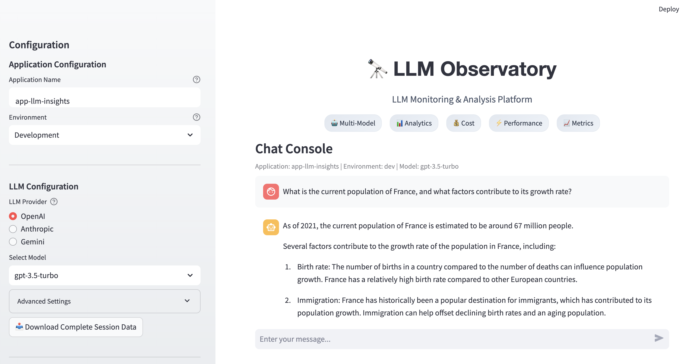
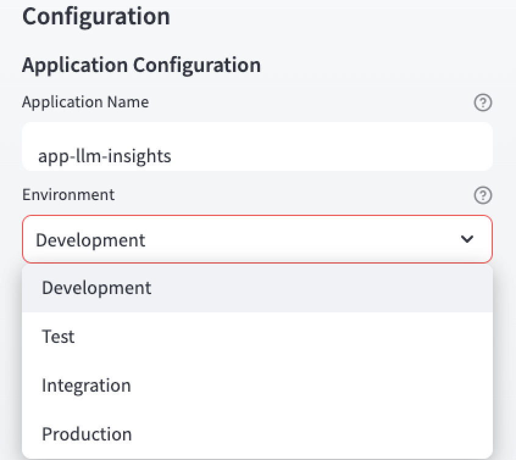

# 🔭 LLM Observatory
### _Unified Platform for multi-vendor LLM Analytics & Observability_

A comprehensive AI Observability Platform designed for enterprise-scale LLM operations. Enable data-driven decisions through real-time cost analysis, performance monitoring, and cross-provider model response analytics (OpenAI, Anthropic, and Google's Gemini).


## Disclaimer

This repository and its contents are entirely personal and do not represent the views of any company or organization. No proprietary code, confidential data, or client-specific implementation details are included. All work has been developed independently for open-source experimentation and public sharing.

## Features

### Multi-Provider Model Integration

- Unified Interface: Single interface for OpenAI, Anthropic, and Gemini models (more to come!).
- Advanced Control Panel: Tailored monitoring for each provider's unique characteristics.
- Cross-Provider Analytics: Compare performance and costs across providers
### Enterprise-Grade Analytics

- Real-Time Cost Tracking: Monitor costs as they occur across all providers.
- Token-Level Analysis: Detailed breakdown of input/output token usage and costs
- Metric Comparison Tools: Get real-time metrics with option to download for offline research
### Scalable & Modular Architecture 
- Enterprise-grade scalability: Offers extendable UI and API to instrument metrics across sessions, applications, and environemnts.
- Modular architecture: Esaily scalable for production deployment. 
- Download feature: Download session history in csv formart for offline research.


## ⚡️ Quick Start 

```
# Clone repository
git clone https://github.com/gpinaki/llm-observatory.git
cd llm-observatory

# Set up virtual environment
python3.11 -m venv venv
source venv/bin/activate  # On Windows: .\venv\Scripts\activate

# Install dependencies
pip install -r requirements.txt

# Configure environment variables
cp .env.example .env

# Add your API keys to .env:
# OPENAI_API_KEY=your-key
# ANTHROPIC_API_KEY=your-key
# VERTEX_API_KEY=your-key

# Set current working directory as Python path
export PYTHONPATH="${PYTHONPATH}:$(pwd)"

# Launch application
streamlit run src/interface/app.py
```

## 💡 Usage Guide
### 1. Control Panel Configuration 
Use the Coniguration section in the sidebar to do the following.
- **Application and Environment Tracking**: Enter application name and choose environment for auditing.

   

- **Provider and Model Selection**: Choose provider, then select specific model for that provider.

    

- **Advanced Configuration**: Adjust token limits and temprature. 

    

- **Easily switch to dashboard**: Toggle to view performance analytics

    

### 2. Interactive unified chat interface
- Real-time interaction with selected LLM provider.

    

- Performance insight of a single request: View token usage and costs as you chat

    

- Double-click detailed response: Click to get detailed response 

    

### 3. Analytics Dashboard 
Comprehensive analytics for decision-making.

- **Overview Tab**: Show a quick compaision of all models used.

    

- **Cost Analysis Tab**: Monitor and compare provider costs

    

- **Performance Tab**: Track and analyze response metrics

    

- **History Tab**: Review detailed interaction history

    

### 4. Download Capability 
- Click on "Download Complete Session Data" button to export all session metrics and interactions.

    ![download-csv][download-csv]


### Project Structure
```
llm-observatory/
├── src/
│   ├── llm/                    # LLM Provider Implementations
│   │   ├── base.py            # Abstract Base Class
│   │   ├── openai_llm.py      
│   │   ├── anthropic_llm.py   
│   │   └── gemini_llm.py      
│   ├── interface/             # UI Components
│   └── config/                # Configuration Management
├── tests/                     # Test Suite
└── assets/                    # Static Resources
```

## 🚀 Implementation Roadmap

### Current Implementation
- ✅ Multi-provider support (OpenAI, Anthropic,Gemini)
- ✅ Cost tracking and analysis
- ✅ Performance monitoring
- ✅ Environment and application instrumentation    
- ✅ Interactive dashboard
- ✅ Download Session  Summary

### Future Enhancements
- 🔄 Database integration
- 🔄 Custom alert configurations 
- 🔄 API Gateway integration
- 🔄 Additional model and vendor support

## 📊 Analytics & Insights

LLM Observatory provides comprehensive analytics to drive informed decision-making for LLM selection and optimization.

What We Track

### Cost Analytics

- **Cost per Token**: Granular cost analysis for input/output tokens
- **Total Cost per Model**: Cumulative cost across different models
- **Cost Trends**: Historical cost patterns and projections
- **Provider Comparison**: Side-by-side cost analysis across providers

#### Response Time Analysis

- **Average Response Time**: Model responsiveness measurement
- **Response Distribution**: Consistency and reliability indicators
- **Processing Speed**: Tokens processed per second

### Usage Analytics

- **Token Utilization**: Input/output token consumption
- **Model Usage Trends**: Preferred models and patterns
- **Environment Metrics**: Performance across Dev/Test/Prod
- **Historical Data**: Session-based analytics

## Strategic Value

- Understand usage patterns across teams
- Plan capacity and resources
- Optimize model selection
- Track environment-specific performance

 ## 🎯 LLM Decision Metrics Guide

Our platform provides comprehensive metrics to help you choose and optimize LLM usage for your specific needs.

### Cost-Performance Matrix

| Metric Category | What We Measure | Why It Matters | How to Track |
|----------------|-----------------|----------------|--------------|
| **Cost Efficiency** |
| Token Costs | • Input token cost<br>• Output token cost<br>• Average cost per request | Helps optimize budget and resource allocation | Check Cost Analysis tab in dashboard |
| Volume Metrics | • Daily token usage<br>• Requests per day<br>• Cost accumulation | Helps in capacity planning | Monitor Overview tab trends |

### Response Time Performance

| Speed Category | Target Range | Best For | Trade-offs |
|---------------|--------------|-----------|------------|
| Ultra Fast (<1s) | 0.5-1.0s | Real-time applications | Higher cost, shorter responses |
| Standard (1-2s) | 1.0-2.0s | Most applications | Balanced cost/performance |
| Batch Mode (2s+) | 2.0s+ | Background processing | Lower cost, longer responses |

### Quality vs Cost Trade-off

```plaintext
Performance Tiers:
├── Premium Tier
│   ├── Cost: $$$
│   ├── Best for: Complex reasoning, accuracy-critical
│   └── Example models: GPT-4, Claude-3-Opus
│
├── Standard Tier
│   ├── Cost: $$
│   ├── Best for: General applications, balanced needs
│   └── Example models: Claude-3-Haiku
│
└── Economy Tier
    ├── Cost: $
    ├── Best for: Simple tasks, high volume
    └── Example models: GPT-3.5-Turbo
```

## 📊 Benefits

- **Unified Interface**: Single UI and API to run queries and compare models across multiple providers.
- **Cost Optimization**: Model usage cost tracking across providers.
- **Metrics Dashboard**: Real-time performance metrics dashboard.
- **Download Capability**: Support CSV download for offline analysis.
- **Scalable Architecture**: Built for enterprise requirements, can be used in multi-environments and multi-application scenario.

## 📝 License

This project is licensed under the MIT License - see [LICENSE](LICENSE) for details.

[](LICENSE)

## 👤 Author

Pinaki Guha  
- LinkedIn: [LinkedIn Profile][linkedin]
- Email: [pinaki.guha@gmail.com](mailto:pinaki.guha@gmail.com)
- Project Link: [LLM Observatory Repo][git-repo-url]
- Portfolio: [Github Link][Portfolio]

## 🙏 Acknowledgments

This project was developed by Pinaki Guha, with supplementary support from AI-based code assistance tools like ChatGPT, Claude, and GitHub Copilot, to streamline specific parts of the development process.

[//]: # (These are reference links used in the body of this note and get stripped out when the markdown processor does its job.)

   [git-repo-url]: <https://github.com/gpinaki/llm-observatory>
   [download-csv]: <assets/screenshots/download_csv.png>
   [download-button]: <assets/screenshots/download_history.png>
   [Portfolio]: <https://github.com/gpinaki>
   [linkedin]: <https://www.linkedin.com/in/pinakiguha/>
   
 
