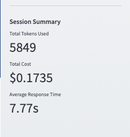

# 🔭 LLM Observatory
### _Unified Platform for multi-vendor LLM Analytics & Observability_

A comprehensive AI Observability Platform designed for enterprise-scale LLM operations. Enable data-driven decisions through real-time cost analysis, performance monitoring, and cross-provider model response analytics (OpenAI, Anthropic, and Google's Gemini).

### Value Proposition for Data Leaders
- **Cost Optimization**: Real-time cost tracking and comparision across LLM providers
- **Performance Analytics**: Comprehensive metrics for informed decision-making
- **Enterprise Integration**: Easily extendable API for multi-environment and multi-application support
- **Scalable Architecture**: Built for enterprise-grade deployments

## Features

### Multi-Provider Model Integration

- Unified Interface: Single interface for OpenAI, Anthropic, and Gemini models (more to come!).
- Advanced Control Panel: Tailored monitoring for each provider's unique characteristics.
- Cross-Provider Analytics: Compare performance and costs across providers
### Comprehensive usage analytics and metrics

- Real-Time Cost Tracking: Monitor costs as they occur across all providers.
- Token-Level Analysis: Detailed breakdown of input/output token usage and costs
- Metric Comparison Tools: Get real-time metrics with option to download for offline research
### Production grade architecture 

- Enterprise-grade observability: Offers extendable UI and API to instrument metrics across sessions, applications, and environemnts.
- Modular architecture: Esaily scalable for production deployment. 
- Download feature: Download session history in csv formart for offline research.

## ⚡️ Quick Start 

```
# Clone repository
git clone https://github.com/gpinaki/llm-observatory.git
cd llm-observatory

# Set up virtual environment
python3.11 -m venv venv
source venv/bin/activate  # On Windows: .\venv\Scripts\activate

# Install dependencies
pip install -r requirements.txt

# Configure environment variables
cp .env.example .env

# Add your API keys to .env:
# OPENAI_API_KEY=your-key
# ANTHROPIC_API_KEY=your-key
# VERTEX_API_KEY=your-key

# Launch application
streamlit run src/interface/app.py
```

## 💡 Usage Guide
### 1. Control Panel Configuration 
Use the Coniguration section in the sidebar to do the following.
- **Environment Selection**: Choose between Dev/Test/Int/Prod.
- **Application Tracking**: Enter application name for audit trail.
    
- Provider Selection: Choose between OpenAI, Anthropic, or Gemini
   
- Model Configuration: Select specific models and parameters
  
- Advanced Configuration: Adjust token limits and temprature 
  
- Toggle to view performance analytics
  

### 2. Interactive unified chat interface
Real-time interaction with selected LLM provider.
    
- Performance insight of a single request: View token usage and costs as you chat
    
- Session-level summary: Track session level usage
    
- Double-click detailed response: Click to get detailed response 
    

### 3. Analytics Dashboard 
Comprehensive analytics for decision-making.
Click Toggle Performance Dashboard Button to review session-level metrics.
- Overview Tab: Show a quick compaision of all models used.
    
- Cost Analysis Tab: Monitor and compare provider costs
    
- Performance Tab: Track and analyze response metrics
    
- History Tab: Review detailed interaction history
    

### 4. Download Capability 
Click on "Download Complete Session Data" button to export all session metrics and interactions.
    ![download-button][download-button]
- Analyze session level requests, responses and the observability metrics in the CSV format.
    ![download-csv][download-csv]

## 📝 License

This project is licensed under the MIT License.

## 🤝 Contributing

Feel free to fork the repository and submit a pull request to contribute to the project.

## 📧 Contact

Pinaki Guha  - [pinaki.guha@gmail.com](mailto:pinaki.guha@gmail.com)
Project Link: [My Github LLM-Repository][git-repo-url]

## 🚀 Implementation Roadmap

### Current Implementation
- ✅ Multi-provider support (OpenAI, Anthropic,Gemini)
- ✅ Cost tracking and analysis
- ✅ Performance monitoring
- ✅ Environment and application instrumentation    
- ✅ Interactive dashboard
- ✅ Download Session  Summary

### Future Enhancements
- 🔄 Database integration for extended history
- 🔄 Custom alert configurations 
- 🔄 Cost prediction modeling
- 🔄 Guardrails for security 

## 📊 Benefits

- **Unified Interface**: Single UI and API to run queries and compare models across multiple providers.
- **Cost Optimization**: Model usage cost tracking across providers.
- **Metrics Dashboard**: Real-time performance metrics dashboard.
- **Download Capability**: Support CSV download for offline analysis.
- **Scalable Architecture**: Built for enterprise requirements, can be used in multi-environments and multi-application scenario.

## 📝 License

This project is licensed under the MIT License - see [LICENSE.md](LICENSE.md) for details.

## 👤 Author

Pinaki Guha  
- LinkedIn: [LinkedIn Profile][linkedin]
- Email: [pinaki.guha@gmail.com](mailto:pinaki.guha@gmail.com)
- Project Link: [LLM Observatory Repo][git-repo-url]
- Portfolio: [Github Link][Portfolio]

## 🙏 Acknowledgments

This project was developed by Pinaki Guha, with supplementary support from AI-based code assistance tools like ChatGPT, Claude, and GitHub Copilot, to streamline specific parts of the development process.

[//]: # (These are reference links used in the body of this note and get stripped out when the markdown processor does its job.)

   [git-repo-url]: <https://github.com/gpinaki/llm-observatory>
   [download-csv]: <assets/screenshots/download_csv.png>
   [download-button]: <assets/screenshots/download_history.png>
   [Portfolio]: <https://github.com/gpinaki>
   [linkedin]: <https://www.linkedin.com/in/pinakiguha/>
   
 
